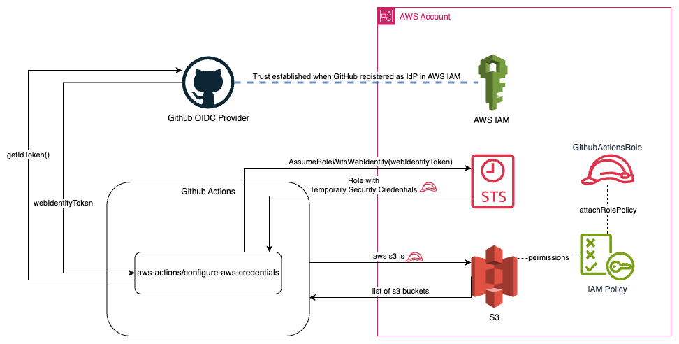

Github Actions workflows requires access to AWS resources for CI/CD. We can use long-term credentials by storing access key id and secret access key as a secret in GitHub, but using long-term credentials is not a security best practice. It is recommended to use short-term credentials. We can use OIDC to gain short term credentials from cloud providers such as AWS, Azure, GCP, HashiCorp, etc.

GitHub provides a comprehensive documentation for [Configuring OIDC in AWS](https://docs.github.com/en/actions/security-for-github-actions/security-hardening-your-deployments/configuring-openid-connect-in-amazon-web-services).

## Setup

The configuration is done in three major steps:

- Creating an Identity Provider (IdP) in AWS
- Creating a role with required permissions in AWS
- Creating/Updating the workflow to use the role to access and use AWS resources

### Creating an Identity Provider (IdP) in AWS

The official documentation for creating an OIDC IdP in AWS can be found [here](https://docs.aws.amazon.com/IAM/latest/UserGuide/id_roles_providers_create_oidc.html#manage-oidc-provider-api).

The steps with the AWS CLI commands are as follows:

- Optional: Get the publicly available configuration and metadata for github actions using <https://token.actions.githubusercontent.com/.well-known/openid-configuration>
- Add the identity provider to AWS
  - `aws iam create-open-id-connect-provider --url https://token.actions.githubusercontent.com`
- Get the ARN for the IdP
  - `aws iam list-open-id-connect-providers`
  - Output(oidc-arn): `arn:aws:iam::<account-number>:oidc-provider/token.actions.githubusercontent.com`
- Add `sts.amazonaws.com` as aud
  - `aws iam add-client-id-to-open-id-connect-provider --client-id sts.amazonaws.com --open-id-connect-provider-arn arn:aws:iam::<account-number>:oidc-provider/token.actions.githubusercontent.com`
- Verify:
  - `aws iam get-open-id-connect-provider --open-id-connect-provider-arn arn:aws:iam::<account-number>:oidc-provider/token.actions.githubusercontent.com`

There is also a CloudFormation template provided by the `aws-actions/configure-aws-actions` that can be used to create the IdP. See [Configure IAM to Trust Github](https://d38mtn6aq9zhn6.cloudfront.net/configure-aws-credentials-latest.yml)

### Create Role with required permissions in AWS

This step involves creating a trust policy for the role to be assumed by GitHub actions. Various versions can be found for limiting access to an org, repository or a branch in the [AWS Documentation](https://docs.aws.amazon.com/IAM/latest/UserGuide/id_roles_create_for-idp_oidc.html#idp_oidc_Create_GitHub). It uses `token.actions.githubusercontent.com:sub` as a key condition for the trust policy.

An example Trust Policy to allow access to an entire GitHub Organization is as follows:

```json
{
  "Version": "2012-10-17",
  "Statement": [
    {
      "Effect": "Allow",
      "Principal": {
        "Federated": "arn:aws:iam::012345678910:oidc-provider/token.actions.githubusercontent.com"
      },
      "Action": "sts:AssumeRoleWithWebIdentity",
      "Condition": {
        "StringEquals": {
          "token.actions.githubusercontent.com:aud": "sts.amazonaws.com",
          "token.actions.githubusercontent.com:sub": "repo:GitHubOrg/*"
        }
      }
    }
  ]
}
```

You can create the role using the json file for the Trust Policy using the following CLI command:
`aws iam create-role --role-name GithubActionsRole --assume-role-policy-document file:<path-to-TrustPolicy.json>`

You can add the required permissions to the created role using [attach-role-policy](https://docs.aws.amazon.com/cli/latest/reference/iam/attach-role-policy.html) command. For example, if you want to grant a administrator access:
`aws iam attach-role-policy --policy-arn arn:aws:iam::aws:policy/PowerUserAccess --role-name GithubActionsRole`

### Creating/Updating the workflow to use the role to access and use AWS resources

The final step is to configure the Github Actions Workflow to configure AWS credentials and access AWS resources.

[aws-actions/configure-aws-credentials](https://github.com/aws-actions/configure-aws-credentials) can be used to configure the AWS credentials.

The job also requires the following permission settings:

```yaml
permissions:
  id-token: write # This is required for requesting the JWT
  contents: read # This is required for actions/checkout
```

A sample workflow to list S3 buckets (assuming appropriate permissions are granted to the GithubActionsRole) is as follows:

```yaml
name: AWS example workflow
on: push

permissions:
  id-token: write # This is required for requesting the JWT
  contents: read # This is required for actions/checkout
jobs:
  ListS3Buckets:
    runs-on: ubuntu-latest
    steps:
      - name: Checkout the repository
        uses: actions/checkout@v4
      - name: Configure AWS Credentials
        uses: aws-actions/configure-aws-credentials@v4
        with:
          role-to-assume: ROLE-TO-ASSUME-ARN
          aws-region: ${{ env.AWS_REGION }}
      # Upload a file to AWS s3
      - name: List S3
        run: aws s3 ls
```

## How it works

The working of OIDC flow is illustrated in the diagram below (dotted lines show the configuration):


The explanation of what is happening is as follows:

- When you create an IAM OIDC Identity Provider, it establishes trust between AWS and Github
- aws-actions/configure-aws-credentials does the following:
  - Generates an OIDC token (sends request to GithubOIDC provider using the specified audience and get JWT ID token that can be used to get the access token from AWS) ([Source Code](https://github.com/aws-actions/configure-aws-credentials/blob/ececac1a45f3b08a01d2dd070d28d111c5fe6722/src/index.ts#L138), uses [getIDToken function in actions/core](https://github.com/aws-actions/configure-aws-credentials/blob/ececac1a45f3b08a01d2dd070d28d111c5fe6722/src/index.ts#L138))
  - Uses the webIdentityToken (OIDC Token) to make an [`AssumeRoleWithWebIdentity`](https://docs.aws.amazon.com/STS/latest/APIReference/API_AssumeRoleWithWebIdentity.html) call to get the AWS STS token
    - AWS uses the established trust relationship to validate the authenticity of the identity token, and returns a STS token
- Once the STS token is received, it can be used to access the AWS resources (for example, when running `aws s3 ls`)
  - AWS validates the assumed role using STS and permissions granted to the role to grant/deny access to permissions

## Additional details on aws-actions/configure-aws-credentials

- If you are using a non-default partition, you need to specify `audience` as an option (For example, `audience: sts.amazonaws.com.cn`) in the Configure AWS Credentials step.
- There are other useful [options](https://github.com/aws-actions/configure-aws-credentials?tab=readme-ov-file#options) such as
  - `role-duration-seconds`
  - `role-session-name`
